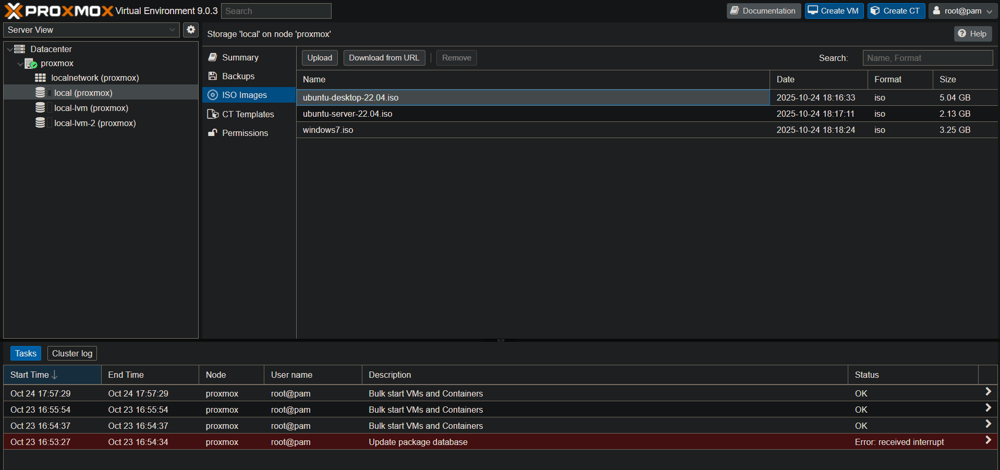
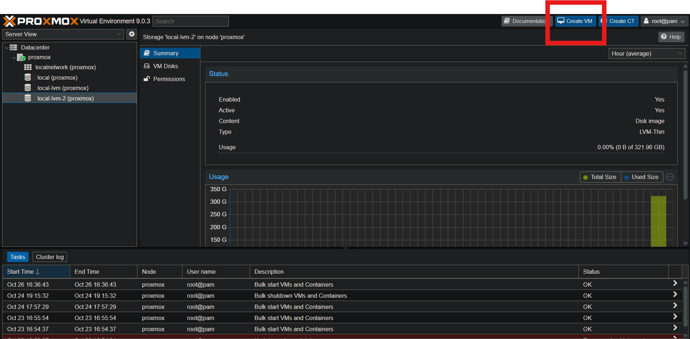
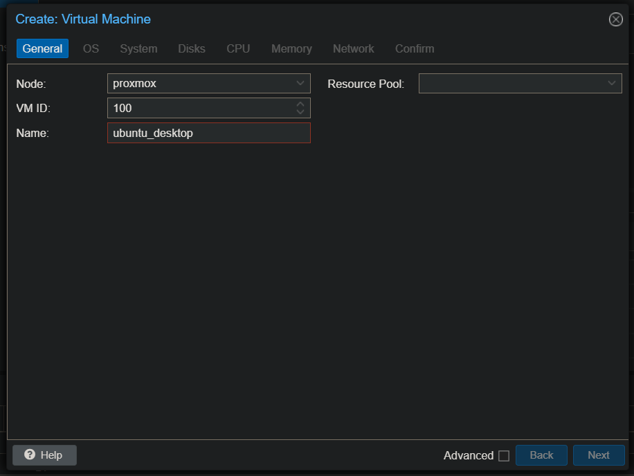
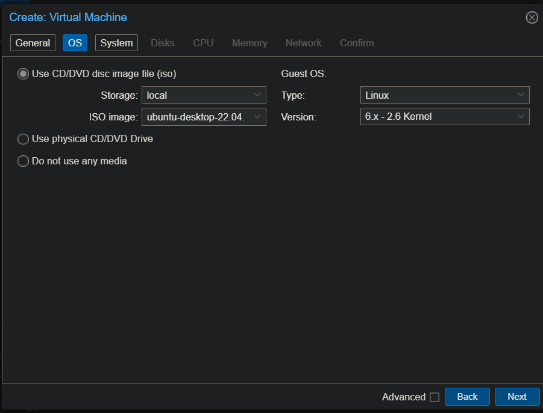
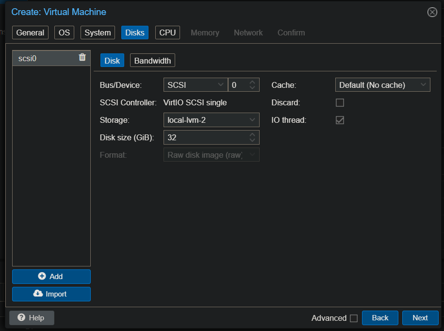
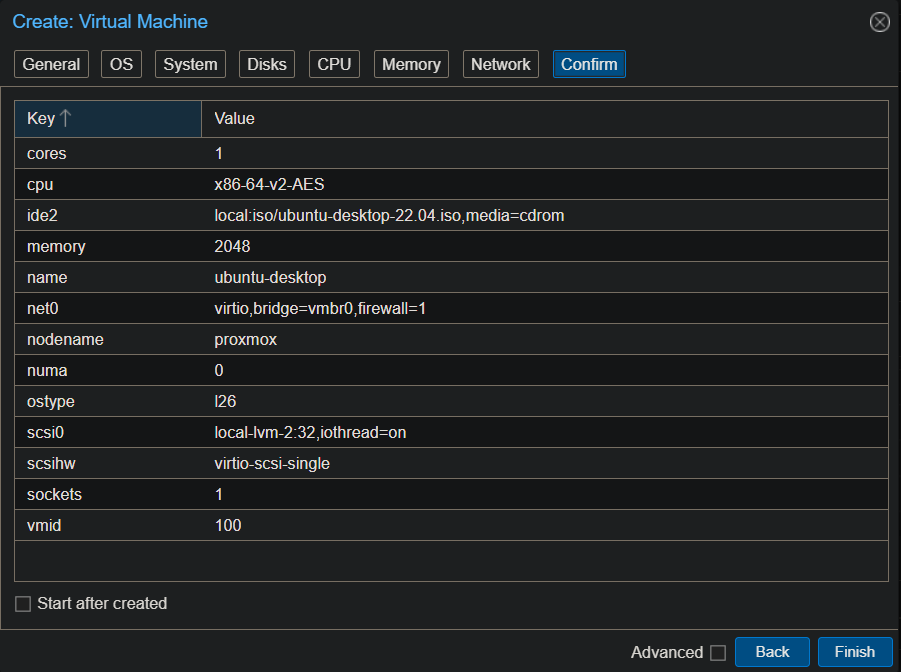
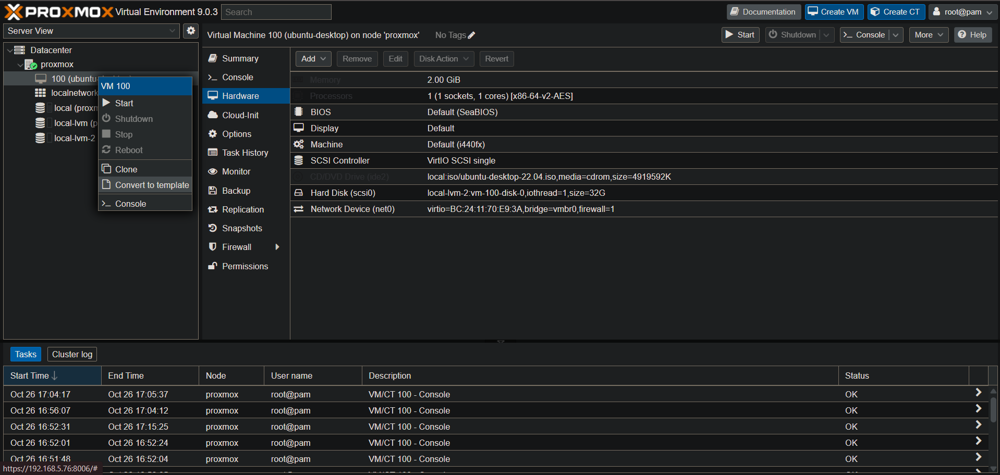
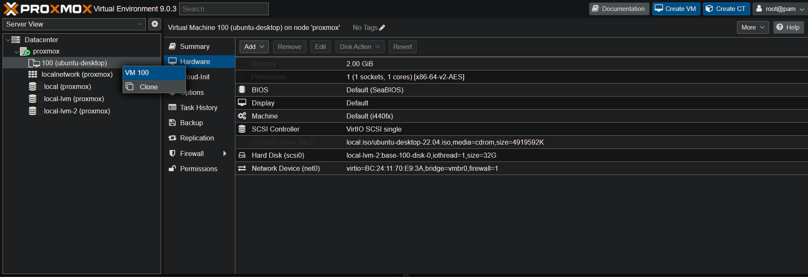
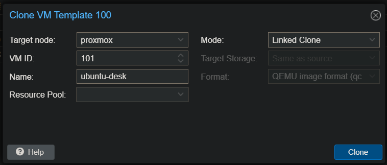

# Proxmox in web with user interface

> ⚠️ **WARNING :** Make you sure you have virtualisation active on the server.

Create machine with proxmox and select graphical install at boot, agree to the license and select disk for install : 


Choose your contry and your keyboard : 


Fill your password and add your mail : 


Configure your network : 


Then click on install.

Once installed, the login is "root" and the password is the password you have enter during install.

## Now, we can add disk to proxmox server : 

To add disk to proxmox server, it's necessary to locate le disk : 

```bash
lsblk
```


And locate the disk, once his locate, you can add disk to proxmox : 

```bash
lvcreate /dev/sdb
vgcreate local-lvm /dev/sdb
lvcreate -l 100%FREE -T local-lvm/local-lvm-2
```

And for add the disk, go to the graphical interface (http://YOUR-IP:8006)

Go to Datacenter > Storage > Add > LVM-Thin : 


And add the disk :


To verify look the new disk and look the size : 


To create VM, you need file in .iso, you can add this in graphical interface in local disk : 



or directly in the server in :

```bash
/var/lib/vz/template/iso
```
## Create template : 

To create template, you must create VM and define this in template :

To create VM, you must to log in proxmox GUI and go to create VM : 




Give a name : 



Select your ISO : 




In Disk, select your second disk and choose the capacity of your virtual disk :




And in other tab, choose your number of CPU or Memory and finish the creation.




Now you have to run your virtual machine and install the system.

When you have install your OS, you can shutdown your VM.

Now you can right click on your VM and select Convert to template : 



Now to create VM, right click on the template and select clone : 



Give a name to the new VM and leave link clone to have rapid creation (but if template are delete, the VM is down) :




