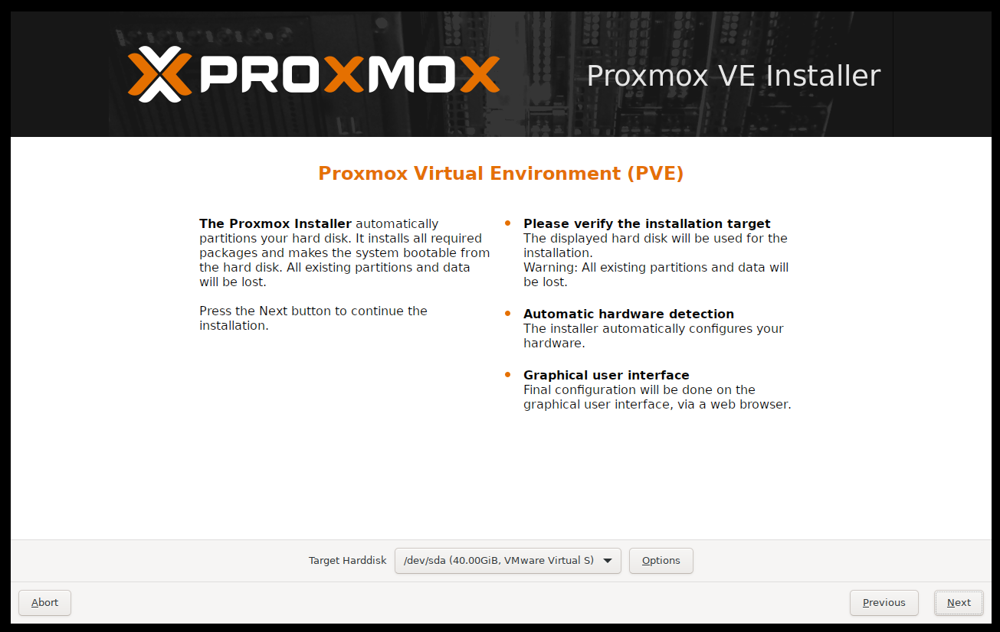
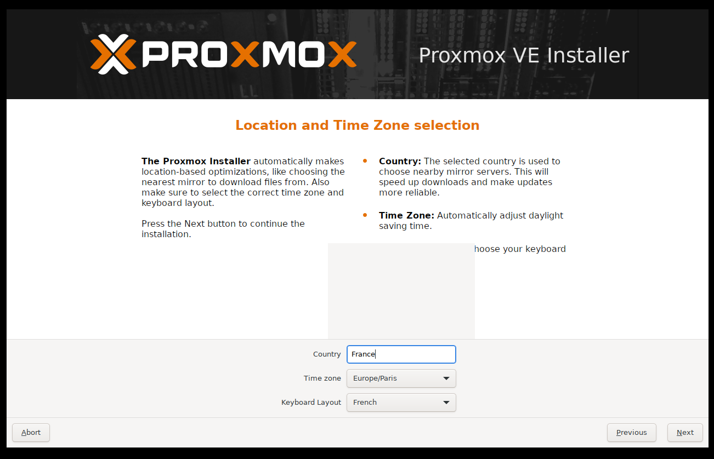
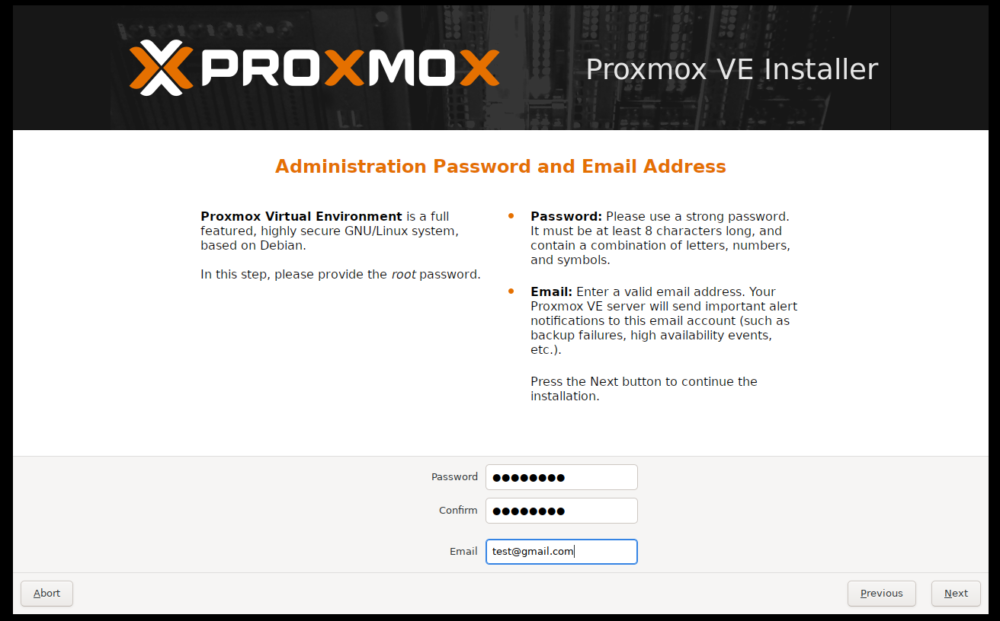
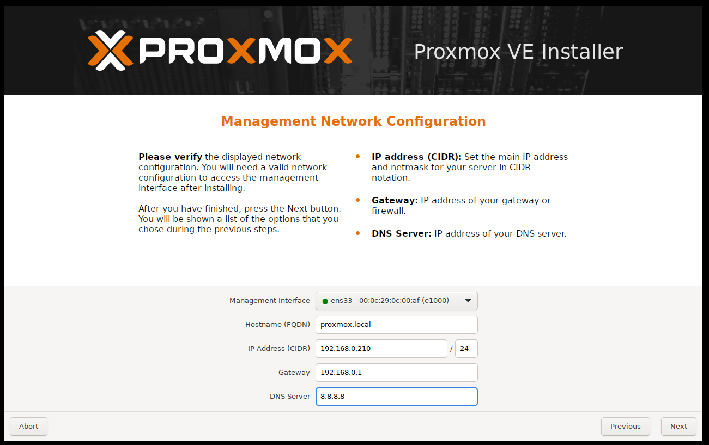
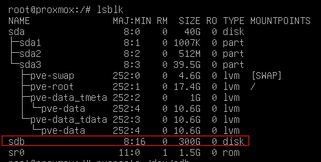
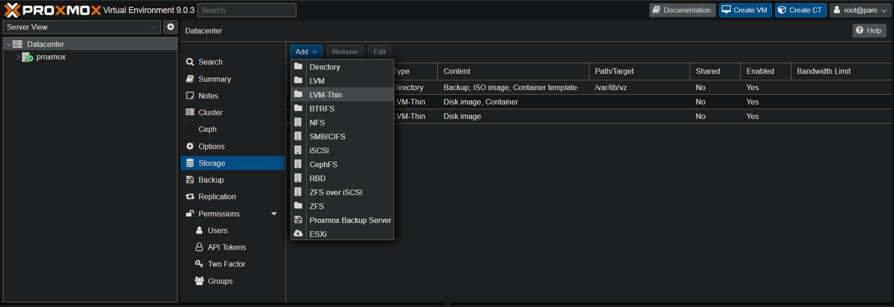
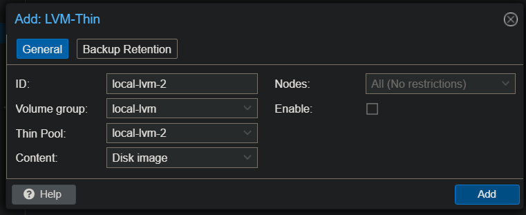
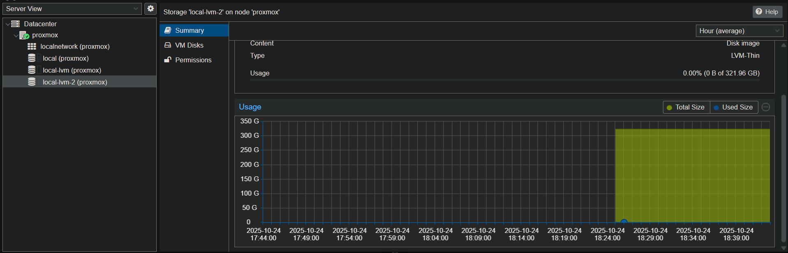

# Proxmox in web with user interface

> ⚠️ **WARNING :** Make you sure you have virtualisation active on the server.

Create machine with proxmox and select graphical install at boot, agree to the license and select disk for install : 



Choose your contry and your keyboard : 




Fill your password and add your mail : 



Configure your network : 



Then click on install.

Once installed, the login is "root" and the password is the password you have enter during install.

## Now, we can add disk to proxmox server : 

To add disk to proxmox server, it's necessary to locate le disk : 

```bash
lsblk
```



And locate the disk, once his locate, you can add disk to proxmox : 

```bash
lvcreate /dev/sdb
vgcreate local-lvm /dev/sdb
lvcreate -l 100%FREE -T local-lvm/local-lvm-2
```

And for add the disk, go to the graphical interface (http://YOUR-IP:8006)

Go to Datacenter > Storage > Add > LVM-Thin : 




And add the disk :



To verify look the new disk and look the size : 


